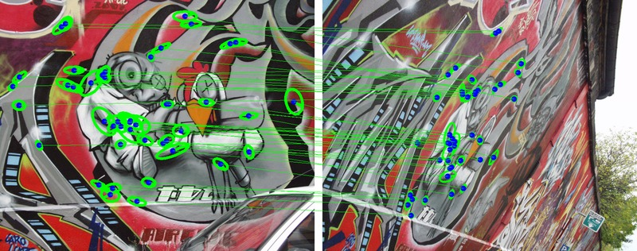
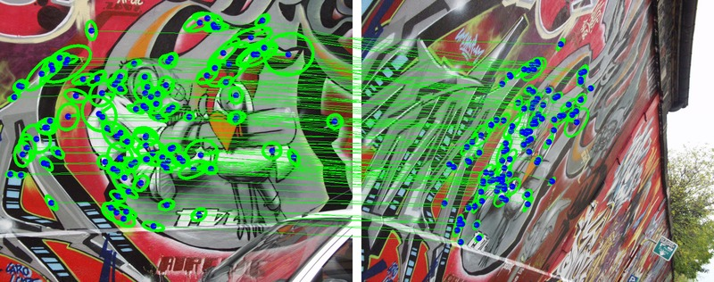

# AffNet model implementation
CNN-based affine shape estimator.

AffNet model implementation in PyTorch for ECCV2018 paper "[Repeatability Is Not Enough: Learning Discriminative Affine Regions via Discriminability](https://arxiv.org/abs/1711.06704)"

AffNet generates up to twice more correspondeces compared to Baumberg iterations




## Retrieval on Oxford5k, mAP

| Detector + Descriptor | BoW  |  BoW + SV | BoW + SV + QE | HQE + MA |
| -----    | ----  |  ---- | ---- | ---- |
| [HesAff](https://github.com/perdoch/hesaff) + [RootSIFT](http://ieeexplore.ieee.org/document/6248018/)    | 55.1  |  63.0 | 78.4 | 88.0 |
| [HesAff](https://github.com/perdoch/hesaff) + [HardNet++](https://github.com/DagnyT/hardnet)   | 60.8  |  69.6 | 84.5 | 88.3 |
| HesAffNet + [HardNet++](https://github.com/DagnyT/hardnet)   | **68.3**  |  **77.8** | **89.0** | **89.5** |

## Datasets and Training

To download datasets and start learning affnet:

```bash
git clone https://github.com/ducha-aiki/affnet
./run_me.sh
```

## Paper figures reproduction

To reproduce Figure 1 in paper, run [notebook](examples/toy_example_figure1/Figure1.ipynb)


To reproduce Figure 2-3 in paper, run notebooks [here](examples/direct_shape_optimization)


```bash
git clone https://github.com/ducha-aiki/affnet
./run_me.sh
```


## Pre-trained models

Pre-trained models can be found in folder pretrained:  AffNet.pth

## Usage example

We provide two examples, how to estimate affine shape with AffNet. 
First, on patch-column file, in [HPatches](https://github.com/hpatches/hpatches-benchmark) format, i.e. grayscale image with w = patchSize and h = nPatches * patchSize

```
cd examples/just_shape
python detect_affine_shape.py imgs/face.png out.txt
```

Out file format is upright affine frame a11 0 a21 a22


Second, AffNet inside pytorch implementation of Hessian-Affine

2000 is number of regions to detect.

```
cd examples/hesaffnet
python hesaffnet.py img/cat.png ells-affnet.txt 2000
python hesaffBaum.py img/cat.png ells-Baumberg.txt 2000
```

output ells-affnet.txt is [Oxford affine](http://www.robots.ox.ac.uk/~vgg/research/affine/) format 
```
1.0
128
x y a b c 
```

## WBS example 


Example is in [notebook](examples/hesaffnet/WBS demo.ipynb)


## Citation

Please cite us if you use this code:

```
@inproceedings{AffNet2017,
 author = {Dmytro Mishkin, Filip Radenovic, Jiri Matas},
    title = "{Repeatability Is Not Enough: Learning Discriminative Affine Regions via Discriminability}",
    year = 2018,
    month = sep,
    booktitle = {Proceedings of ECCV}
    }
```
